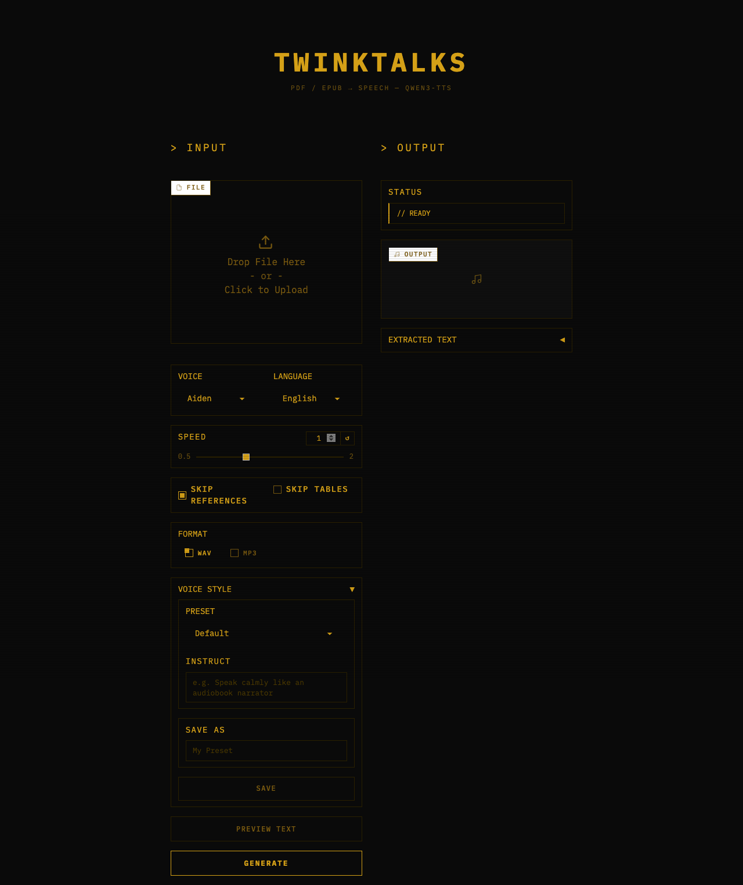

<div align="center">

# TWINKTALKS

**PDF & EPUB to speech — powered by Qwen3-TTS**

Convert academic papers, textbooks, and e-books into natural-sounding audio.


</div>

---

## Features

- **PDF + EPUB support** — multi-column papers (pdfplumber + PyMuPDF), e-books (ebooklib + BeautifulSoup)
- **File queue** — upload multiple files, processes them sequentially with per-file progress
- **Streaming playback** — audio plays progressively as chunks are generated
- **Chapter markers in MP3** — ID3v2 CHAP/CTOC frames for skipping between chapters in VLC, Apple Podcasts, Overcast
- **WAV & MP3 export** — choose format in UI or via file extension in CLI
- **Batch processing** — `--chapters all` generates a separate audio file per chapter
- **TOC & chapter selection** — auto-detects table of contents, select specific chapters
- **Skip tables** — excludes diagnostic tables, DSM criteria, etc.
- **Voice modulation** — natural language `instruct` parameter controls tone and style
- **8 built-in voice presets** — Calm Narrator, Energetic, Audiobook, Whisper, and more
- **Custom favorites** — save your own presets in the web UI
- **Speed control** — 0.5x to 2.0x via native Qwen3-TTS parameter
- **Session resume** — interrupted generation picks up where it stopped
- **Academic text cleanup** — removes citations, URLs, DOIs, section numbers; expands abbreviations
- **9 speakers, 10+ languages** — English, Chinese, Japanese, Korean, German, French, Russian, and more

## Requirements

- **Apple Silicon Mac** (M1/M2/M3/M4) with **32GB+ unified memory** recommended
- Python 3.12+
- System deps: `portaudio`, `ffmpeg`, `sox`

## Quick Start

```bash
git clone https://github.com/NolaKa/TwinkTalks.git
cd TwinkTalks
chmod +x setup.sh && ./setup.sh
source .venv/bin/activate
```

## Usage

### Web UI

```bash
python -m twinktalks.web
# Open http://localhost:7860
```

Upload a PDF or EPUB. Configure voice, speed, format, and hit **GENERATE** — audio streams in real time.

Upload **multiple files** for queue mode — each file is processed sequentially with per-file progress tracking.



### CLI

```bash
# Basic conversion
python -m twinktalks paper.pdf -o output.wav
python -m twinktalks book.epub -o output.mp3

# Voice and language
python -m twinktalks paper.pdf --speaker Ryan --language English -o output.wav

# Speed control
python -m twinktalks paper.pdf --speed 0.8 -o output.wav

# Preview text only (no TTS)
python -m twinktalks paper.pdf --dry-run

# Page range
python -m twinktalks paper.pdf --pages 3-7 -o output.wav

# Batch — one audio file per chapter
python -m twinktalks textbook.pdf --chapters all

# MP3 with chapter markers
python -m twinktalks textbook.pdf --chapter-markers -o output.mp3

# Voice presets
python -m twinktalks paper.pdf --preset "Audiobook" -o output.wav
python -m twinktalks --list-presets

# Voice style instruction
python -m twinktalks paper.pdf --instruct "Speak calmly like a narrator" -o output.wav

# Skip tables / keep references
python -m twinktalks paper.pdf --skip-tables --no-skip-references -o output.wav

# Resume interrupted session
python -m twinktalks paper.pdf --list-sessions
python -m twinktalks paper.pdf --resume <session-id> -o output.wav
```

## How It Works

```
PDF/EPUB → Extract text → Preprocess → Chunk → TTS → Audio
```

1. **Extract** — pdfplumber reads PDF with `layout=True` for multi-column support, ebooklib handles EPUB. Per-page extraction enables chapter marker timing.
2. **Preprocess** — removes `[1,2]` citations, `(Author et al., 2024)`, figure captions, URLs, DOIs; expands abbreviations.
3. **Chunk** — splits into ~500 char chunks at sentence boundaries (NLTK), preserving paragraphs. Page-aware mode tracks source page per chunk.
4. **Synthesize** — Qwen3-TTS generates audio chunk by chunk with retry logic and silence fallback. Streaming mode yields cumulative waveform after each chunk.
5. **Export** — concatenates with natural pauses (400ms sentences, 800ms paragraphs). MP3 with `--chapter-markers` embeds ID3v2 CHAP/CTOC frames.

## Voice Presets

| Preset | Speaker | Speed | Style |
|--------|---------|-------|-------|
| Default | Aiden | 1.0x | neutral |
| Calm Narrator | Aiden | 0.9x | calm, measured, soothing |
| Energetic | Ryan | 1.1x | energetic, enthusiastic |
| Warm & Gentle | Aria | 0.9x | warm, gentle |
| Lecture/Academic | Leo | 0.95x | clear, professorial |
| Audiobook | Aiden | 0.85x | professional narrator |
| Fast Summary | Ryan | 1.3x | quick, concise |
| Whisper | Aria | 0.8x | soft, intimate whisper |

Save custom presets in the web UI via **VOICE STYLE → SAVE AS**.

## Project Structure

```
twinktalks/
├── config.py             # Constants: model, speaker, chunking, audio, speed
├── extractor.py          # File type router → PDF or EPUB extractor
├── pdf_extractor.py      # pdfplumber + PyMuPDF fallback, table skipping
├── epub_extractor.py     # ebooklib + BeautifulSoup, spine-based chapters
├── text_preprocessor.py  # Citation removal, abbreviation expansion
├── chunker.py            # Sentence-boundary chunking (NLTK), page-aware mode
├── tts_engine.py         # Qwen3-TTS: MPS/SDPA/float16, streaming + batch
├── audio_utils.py        # Waveform concat, silence, WAV/MP3, chapter markers
├── toc.py                # TOC extraction, Chapter dataclass
├── session.py            # Per-chunk saving, resume support
├── presets.py            # Built-in + user presets
├── cli.py                # CLI with batch processing, chapter markers
└── web.py                # Gradio web UI, retro terminal theme
```

## Model

Uses [Qwen3-TTS-12Hz-1.7B-CustomVoice](https://huggingface.co/Qwen/Qwen3-TTS-12Hz-1.7B-CustomVoice) (~3.5GB, downloads automatically on first run).

- `device_map="mps"` — Apple Silicon Metal
- `attn_implementation="sdpa"` — SDPA (FlashAttention unavailable on macOS)
- `dtype=float16`

For faster download:
```bash
pip install -U "huggingface_hub[cli]" hf_transfer
HF_HUB_ENABLE_HF_TRANSFER=1 huggingface-cli download Qwen/Qwen3-TTS-12Hz-1.7B-CustomVoice
```

## Tests

```bash
python -m pytest tests/ -v
```

133 unit tests covering: preprocessor, chunker, PDF/EPUB extraction, TOC, sessions, presets, CLI batch, chapter markers, chunk offsets, chunk-to-chapter mapping.

## Dependencies

**System:** `brew install portaudio ffmpeg sox`

**Python:** `pip install -r requirements.txt` — qwen-tts, torch, pdfplumber, PyMuPDF, ebooklib, beautifulsoup4, nltk, soundfile, pydub, mutagen, gradio, tqdm
