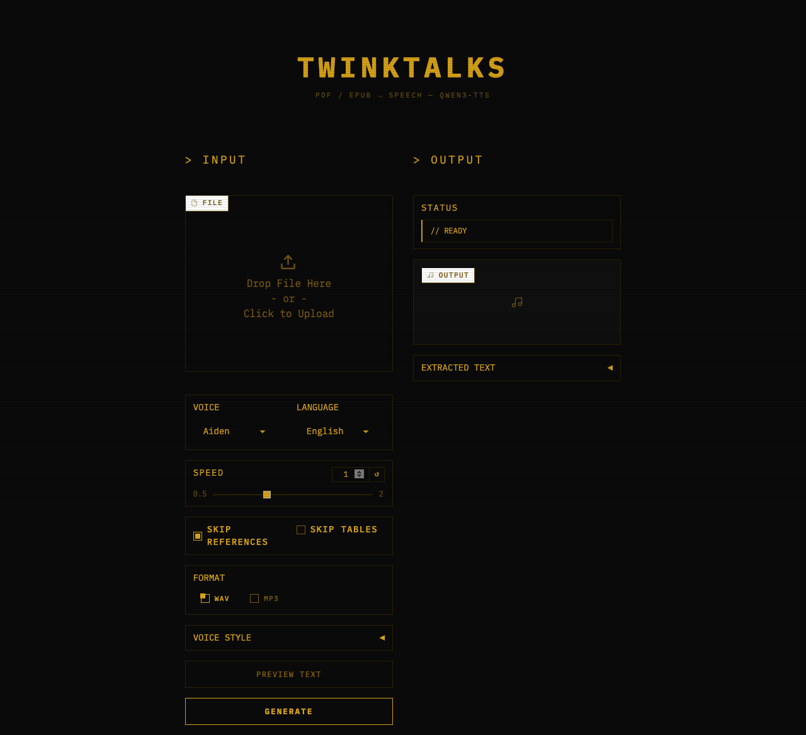

<div align="center">

# TWINKTALKS

**PDF & EPUB to speech — powered by Qwen3-TTS**

Convert academic papers, textbooks, and e-books into natural-sounding audio.



</div>

---

## Features

- **PDF + EPUB support** — handles multi-column academic papers (pdfplumber with `layout=True` + PyMuPDF fallback) and e-books (ebooklib + BeautifulSoup)
- **File queue** — upload multiple PDF/EPUB files at once, processes them sequentially with per-file progress tracking
- **Streaming playback** — web UI plays audio progressively as chunks are generated, no waiting for the full file
- **Chapter markers in MP3** — embeds ID3v2 CHAP/CTOC frames so you can skip between chapters in VLC, Apple Podcasts, Overcast, and other players
- **WAV & MP3 export** — choose output format in the web UI or via file extension in CLI
- **Batch processing** — `--chapters all` generates a separate audio file per chapter
- **Table of contents & chapters** — auto-detects TOC from PDF (PyMuPDF `get_toc()`) or EPUB (spine items), select specific chapters by name or index
- **Skip tables** — excludes diagnostic tables, DSM criteria, etc. from speech output via `find_tables()` bbox exclusion
- **Voice modulation** — natural language `instruct` parameter passed to `generate_custom_voice()` controls emotion, tone, and style (e.g. "Speak calmly like an audiobook narrator")
- **8 built-in voice presets** — Default, Calm Narrator, Energetic, Warm & Gentle, Lecture/Academic, Audiobook, Fast Summary, Whisper
- **Custom favorites** — save your own speaker + speed + instruct combos as reusable presets (`~/.twinktalks/presets.json`), appear with `*` prefix in dropdown
- **Speed control** — adjustable speaking rate (0.5x-2.0x) via native Qwen3-TTS `speed` parameter, no post-processing
- **Session resume** — saves progress per chunk to `~/.twinktalks/sessions/<id>/` (session.json + chunk_NNNN.wav files), resume interrupted generation from where it stopped
- **Academic text cleanup** — removes `[1,2]` citations, `(Author et al., 2024)`, figure/table captions, URLs, DOIs, section numbers; expands abbreviations (`e.g.` → `for example`)
- **Sentence-aware chunking** — splits long documents into ~500 character chunks at sentence boundaries (NLTK), preserving paragraph structure with `max_new_tokens=1024`
- **Page-aware chunking** — tracks which page each chunk originated from (`Chunk.source_page`), enabling accurate chapter marker placement in MP3
- **9 speaker voices** — Aiden, Ryan, Aria, Claire, Emma, Leo, Mia, Noah, Sophia
- **10+ languages** — English, Chinese, Japanese, Korean, German, French, Russian, Portuguese, Spanish, Italian

## Requirements

- **Apple Silicon Mac** (M1/M2/M3/M4) with **32GB+ unified memory** recommended
- Python 3.12+
- System deps: `portaudio`, `ffmpeg`, `sox` (installed via Homebrew)

## Quick Start

```bash
git clone https://github.com/NolaKa/TwinkTalks.git
cd TwinkTalks
chmod +x setup.sh && ./setup.sh
source .venv/bin/activate
```

## Usage

### Web UI

```bash
python -m twinktalks.web
# Open http://localhost:7860
```

#### Single file mode

Upload a PDF or EPUB. The UI shows:
- **Page range** (FROM PAGE / TO PAGE) — appears after upload, auto-detected page count
- **Chapter dropdown** — auto-detected TOC, selecting a chapter updates the page range
- **Voice / Language / Speed** — 9 speakers, 10+ languages, 0.5-2.0x speed slider
- **Skip References / Skip Tables** — checkboxes for academic text cleanup
- **Format** — WAV or MP3. MP3 output automatically embeds chapter markers if the file has a TOC
- **Voice Style** accordion — preset dropdown (8 built-in + your saved favorites), instruct text field for natural language voice control, save button for custom presets
- **Preview Text** — extract and display text without generating audio
- **Generate** — starts streaming synthesis. Audio player updates after each chunk. Status bar shows real-time progress: `// GENERATING — chunk 3/15 — 42.1s`

#### File queue mode

Upload **multiple files** at once (drag & drop or multi-select). Page range and chapter controls are hidden — each file is processed with all pages using the shared voice/speed/preset settings.

Status format: `// QUEUE 2/5 — "textbook.pdf" — chunk 3/15 — 42.1s`

After all files complete, a **COMPLETED FILES** panel appears with download links for every generated audio file.

### CLI

```bash
# Basic: PDF or EPUB to WAV
python -m twinktalks paper.pdf -o output.wav
python -m twinktalks book.epub -o output.wav

# Choose voice and language
python -m twinktalks paper.pdf -o output.mp3 --speaker Ryan --language English

# Preview extracted text (no TTS)
python -m twinktalks paper.pdf --dry-run

# Specific page range
python -m twinktalks paper.pdf --pages 3-7 -o output.wav

# Limit to first N pages
python -m twinktalks paper.pdf --max-pages 5 -o output.wav

# Include references section
python -m twinktalks paper.pdf --no-skip-references -o output.wav

# Speed control (0.5 = slow, 2.0 = fast)
python -m twinktalks paper.pdf --speed 0.8 -o output.wav

# Skip tables and diagrams
python -m twinktalks paper.pdf --skip-tables -o output.wav

# Show table of contents
python -m twinktalks paper.pdf --show-toc

# Extract specific chapter (by name or index)
python -m twinktalks paper.pdf --chapter "Introduction" -o output.wav
python -m twinktalks paper.pdf --chapter 3 -o output.wav

# Batch: generate one audio file per chapter
python -m twinktalks textbook.pdf --chapters all
python -m twinktalks textbook.epub --chapters all -o output_dir/

# Voice style instruction
python -m twinktalks paper.pdf --instruct "Speak calmly like a narrator" -o output.wav

# Use a built-in voice preset
python -m twinktalks paper.pdf --preset "Audiobook" -o output.wav
python -m twinktalks paper.pdf --preset "Whisper" -o output.wav

# List all available presets
python -m twinktalks --list-presets

# MP3 with chapter markers (embeds ID3v2 CHAP frames — jump between chapters in VLC/podcast apps)
python -m twinktalks textbook.pdf --chapter-markers -o output.mp3

# Resume interrupted session
python -m twinktalks paper.pdf --list-sessions
python -m twinktalks paper.pdf --resume <session-id> -o output.wav
```

## How It Works

```
PDF/EPUB → Extract text → Preprocess → Chunk → TTS → Audio
```

1. **Extract** — pdfplumber reads PDF with `layout=True` for multi-column support (or ebooklib for EPUB), crops headers/footers, truncates at References. Supports per-page extraction for chapter marker timing.
2. **Preprocess** — removes `[1,2]` citations, `(Author et al., 2024)`, figure/table captions, URLs, DOIs, section numbers; expands abbreviations (`e.g.` → `for example`). All 20+ regex patterns pre-compiled at module load.
3. **Chunk** — splits into ~500 character chunks at sentence boundaries, preserving paragraph structure. Optional page-aware mode tracks source page per chunk for chapter marker placement.
4. **Synthesize** — Qwen3-TTS generates audio chunk by chunk with retry logic (3 attempts, silence fallback), applying voice style via `instruct` parameter. Streaming mode yields cumulative waveform after each chunk with incremental concatenation.
5. **Export** — concatenates with natural pauses (400ms between sentences, 800ms between paragraphs), saves as WAV or MP3. For MP3 with `--chapter-markers`, embeds ID3v2 CHAP/CTOC frames mapping TOC chapters to audio timestamps.

## Chapter Markers

When generating MP3 output, TwinkTalks can embed chapter markers that let you jump between sections in your audio player.

**How it works:**
1. Text is extracted per-page (preserving page numbers)
2. Each chunk records which page it came from (`source_page`)
3. After synthesis, chunk timing offsets are computed (accounting for inter-sentence/paragraph silence)
4. TOC chapters are mapped to audio timestamps via page ranges
5. ID3v2 CHAP frames + CTOC table of contents frame are written to the MP3 file using mutagen

**CLI:**
```bash
python -m twinktalks textbook.pdf --chapter-markers -o textbook.mp3
```

**Web UI:** Select "MP3" format — chapter markers are embedded automatically when the file has a detected TOC.

**Supported players:** VLC, Apple Podcasts, Overcast, Pocket Casts, most podcast apps, and any player supporting ID3v2 chapter frames.

## Voice Presets

| Preset | Speaker | Speed | Style |
|--------|---------|-------|-------|
| Default | Aiden | 1.0x | (neutral) |
| Calm Narrator | Aiden | 0.9x | Speak in a calm, measured, soothing tone... |
| Energetic | Ryan | 1.1x | Speak with energy and enthusiasm... |
| Warm & Gentle | Aria | 0.9x | Speak warmly and gently... |
| Lecture/Academic | Leo | 0.95x | Speak clearly like a university professor... |
| Audiobook | Aiden | 0.85x | Speak like a professional audiobook narrator... |
| Fast Summary | Ryan | 1.3x | Speak quickly and concisely... |
| Whisper | Aria | 0.8x | Speak in a soft, intimate whisper... |

**Custom presets:** Save your own speaker + speed + instruct combos in the web UI (VOICE STYLE → SAVE AS) or manage them directly in `~/.twinktalks/presets.json`. User presets appear with a `*` prefix in the dropdown.

## Project Structure

```
twinktalks/
├── config.py             # All constants: model ID, speaker, chunking, audio, speed, sessions
├── extractor.py          # File type router — dispatches to PDF/EPUB extractor by extension
├── pdf_extractor.py      # pdfplumber (layout=True) + PyMuPDF fallback, table skipping, per-page extraction
├── epub_extractor.py     # ebooklib + BeautifulSoup, spine-based chapter navigation, per-item extraction
├── text_preprocessor.py  # Remove citations, expand abbreviations, truncate at references
├── chunker.py            # Split into ~500 char chunks at sentence boundaries (NLTK), page-aware chunking
├── tts_engine.py         # Qwen3-TTS wrapper — MPS/SDPA/float16, streaming + batch synthesis
├── audio_utils.py        # Concatenate waveforms, silence gaps, WAV/MP3 export, chapter markers (ID3v2)
├── toc.py                # TOC extraction (PyMuPDF get_toc()), Chapter dataclass
├── session.py            # SessionManager — per-chunk WAV saving, resume support
├── presets.py            # Built-in voice presets + user favorites (~/.twinktalks/presets.json)
├── cli.py                # CLI with batch chapter processing, chapter marker embedding
└── web.py                # Gradio web UI with streaming playback, file queue, format selection
```

## Model

Uses [Qwen3-TTS-12Hz-1.7B-CustomVoice](https://huggingface.co/Qwen/Qwen3-TTS-12Hz-1.7B-CustomVoice) with:
- `device_map="mps"` (Apple Silicon Metal)
- `attn_implementation="sdpa"` (FlashAttention unavailable on macOS)
- `dtype=float16`

The model (~3.5GB) downloads automatically on first run.

### Slow download?

The default download can be slow. For faster speeds, pre-download the model manually:

```bash
pip install -U "huggingface_hub[cli]" hf_transfer
HF_HUB_ENABLE_HF_TRANSFER=1 huggingface-cli download Qwen/Qwen3-TTS-12Hz-1.7B-CustomVoice
```

`hf_transfer` uses multi-threaded downloads and is significantly faster than the default.

### Expected warnings on macOS

```
Warning: flash-attn is not installed. Will only run the manual PyTorch version.
```

This is normal — FlashAttention is CUDA-only. TwinkTalks uses SDPA (Scaled Dot Product Attention) instead, which works on Apple Silicon.

## Dependencies

**System** (via Homebrew):
```bash
brew install portaudio ffmpeg sox
```

**Python** (via pip):
```
qwen-tts          # TTS model interface
torch              # PyTorch (MPS backend)
pdfplumber         # PDF extraction with layout mode
PyMuPDF            # PDF fallback + TOC extraction
ebooklib           # EPUB parsing
beautifulsoup4     # HTML text extraction from EPUB
nltk               # Sentence tokenization
soundfile          # WAV I/O
pydub              # MP3 export (via ffmpeg)
mutagen            # ID3v2 chapter marker embedding in MP3
numpy              # Audio array operations
gradio             # Web UI framework
tqdm               # CLI progress bars
pytest             # Test framework
```

Full list with version constraints: [`requirements.txt`](requirements.txt)

## Tests

```bash
source .venv/bin/activate
python -m pytest tests/ -v
```

148 unit tests covering: text preprocessor, chunker (including page-aware chunking), PDF extractor, EPUB extractor, extractor router, TOC, sessions, presets, CLI batch helpers, chapter markers (ID3 embedding + reading back), chunk offset computation, chunk-to-chapter mapping.
